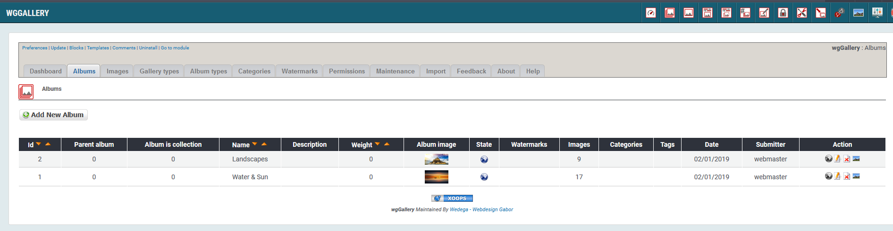
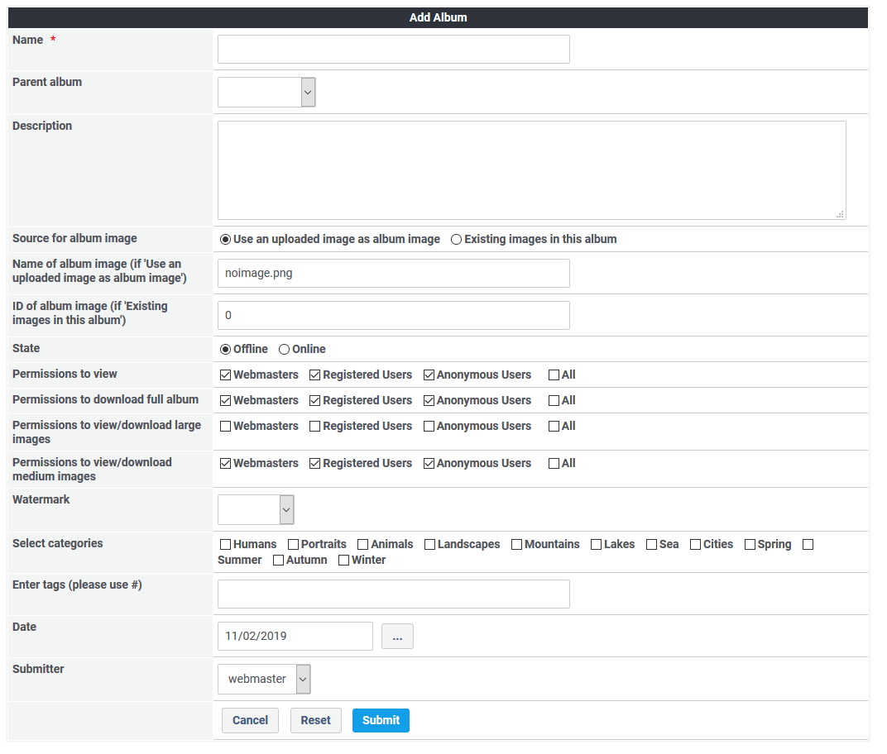

# Alben

Sie können beiliebig viele Alben erstellen, welche wiederum mit anderen Alben in einer Albensammlung kombiniert werden können.

## 1. Liste der Alben

Auf dem Registerblatt 'Alben' sehen Sie eine Liste der bestehenden Alben und deren wichtigsten Einstellungen.

## 2. Erstellen/Bearbeiten von Alben

### 2.1. Albumname

Definieren Sie einn Albumnamen. Dieser wird auch auf der Benutzerseite angezeigt.

### 2.2. Albumbeschreibung

Sie können zusätzliche Informationen zu Ihrem Album erfassen, welche auch auf der Benutzerseite angezeigt werden.

### 2.3. Albumbild

Sie können pro Album ein Albumbild verwenden. Dieses wird auch auf der Benutzerseite angezeigt. Sie können

* ein Bild aus dem Album oder bei Albensammlungen ein Bild aus allen Unteralben verwenden
* eine Bildercollage mit Bildern des Albums erstellen
* Bilder des Albums bearbeiten (zuschneiden, drehen,....)
* ein neues Bild hochladen

Für weitere Information betreffend Albumbild siehe auch [Album image](../the-user-side/album-image.md).

### 2.4. Status

Sie können Ihr Album Online oder Offline stellen. Nur wenn das Album den Status Online hat ist es auf der Benutzerseite für die anderen User sichtbar. Sofern der Einsender nicht die Berechtigung zum Onlinestellen besitzt, so erhält das Album automatisch den Stauts "Warten auf Freigabe". Die Freigabe hat dann durch einen autorisierten User zu erfolgen.

### 2.5. Berechtigungen

Sie können folgende Berechtigungen je Gruppe vergeben:

* Berechtigungen zum Anzeigen
* Berechtigungen zum Download des gesamten Albums
* Berechtigungen zur Anzeige/zum Download großer Bilder
* Berechtigungen zur Anzeige/zum Download mittlerer Bilder

Für weitere Information betreffend Berechtigungen siehe auch [Permissions](permissions.md).

### 2.6. Wasserzeichen

Sie können definieren, welches Wasserzeichen den in diesem Album hochgeladenen Bildern hinzugefügt wird.

Für weitere Information betreffend Wasserzeichen siehe auch [Watermarks](watermarks.md).

### 2.7. Kategorien

Sie können verschiedene Kategorien erstellen, die mit Bildern oder Alben verknüpft werden können und so eine Klassifizierung ermöglichen. Diese Kategorien werden auch für eine gezielte Suche verwendet.

Für weitere Information betreffend Kategorien siehe auch [Categories](categories.md).

### 2.8. Tags

Jedes Bild und jedes Album können zusätzlich mit Tags versehen werden, um eine Klassifizierung zu ermöglichen. Diese Tags werden auch für eine gezielte Suche verwendet.
