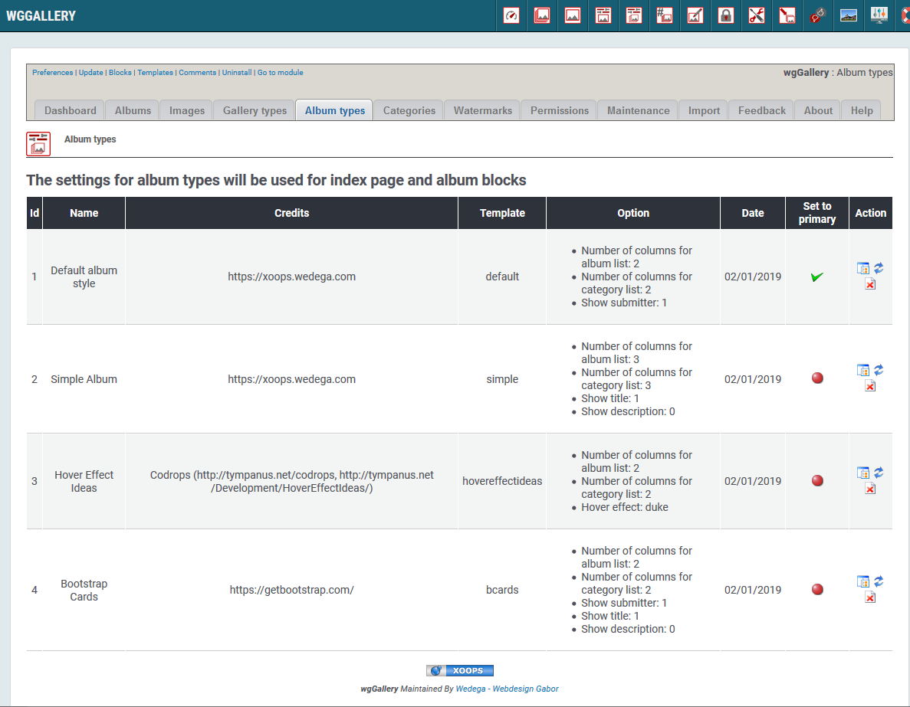

# Albumtypen

Sie können verschiedene Albumtypen definieren. Abhängig von Ihren Einstellungen ändert sich das Erscheinungsbild auf der Benutzerseite.

Albumtypen werden verwendet für die Anzeige:

* auf der Indexseite
* in den Blöcken

## 1. Liste der Albumtypen

Auf dem Registerblatt 'Albumtypen' sehen Sie eine Liste der derzeit existierenden Albumtypen.

Folgenden Albumtypen sind derzeit implementiert:

* Default album style
* Simple Album
* Hover Effect Ideas
* Bootstrap Cards

Für jeden Albumtyp gibt es unterschiedliche Einstellungsparameter, sodass Sie die Anzeige Ihren Wünschen entsprechend anpassen können. Sie können z.B. festlegen:

* Anzahl der Einträge proZeile
* Anzeige von Infos \(wie Name, Titel,...\)
* und einiges mehr

Da für eine Implementierung neuer Albumtypen erweiterte Kenntnisse erforderlich sind ist standardmäßig keine Schaltfläche "hinzufügen" vorhanden.

