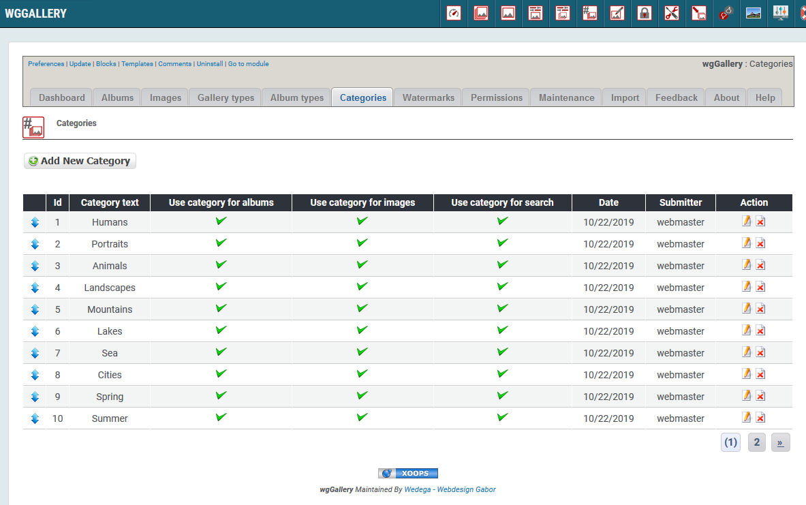
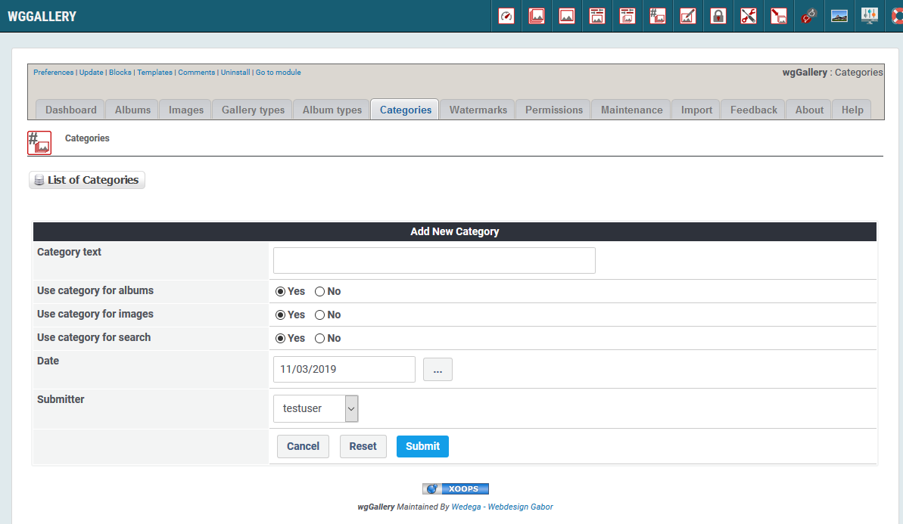

# Kategorien

Sie können verschiedene Kategorien definieren, die zur Klassifizierung von Alben und Bildern verwendet werden können.

Die Kategorien können außerdem für eine gezielte Suche verwendet werden \(siehe [Search]()\).

## 1. Liste der Kategorien

Auf dem Registerblatt 'Kategorien' sehen Sie eine Liste der bestehenden Alben und deren wichtigsten Einstellungen.

## 2. Erstellen/Bearbeiten von Kategorien

### 2.1. Kategorietext

Dieser Text wird auf der Benutzerseite angezeigt.

### 2.2. Verwendung der Kategorien

Sie können entscheiden wofür ein Kategorie verwendet werden soll::

* Für Alben
* Für Bilder
* Für das Suchformular

