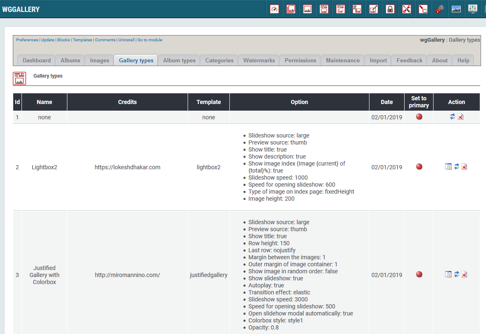

# Galerietypen

You can define various different gallery types. Depending on your selection and your settings the images will be shown in one of the slideshows .
Sie können verschiedene Galerietypen definieren. Abhängig von Ihren Einstellungen werden die Bilder eines Albums in der gewählten Slideshow \(Galerietyp\) angezeigt.

## 1. Liste der Galerietypen

Auf dem Registerblatt 'Galerietypen' sehen Sie eine Liste der bestehenden Alben und deren wichtigsten Einstellungen.

Folgende Galerietypen sind derzeit implentiert:

* Lightbox2
* Justified Gallery with Colorbox
* ViewerJs
* Jssor
* LC Lightbox LITE

Für jeden Galeriety gibt es unterschiedliche Einstellungsparameter, sodass Sie die Anzeige Ihren Wünschen entsprechend anpassen können. Sie können z.B. festlegen:

* Bilderquelle
* Anzeige von Infos \(wie Name, Titel,...\)
* Autoplay
* Slideshow-Geschwindigkeit
* und vieles mehr

Da für eine Implementierung neuer Galerietypen umfassende Kenntnisse über die Arbeitsweise von wgGallery erforderlich sind ist standardmäßig keine Schaltfläche "hinzufügen" vorhanden.

