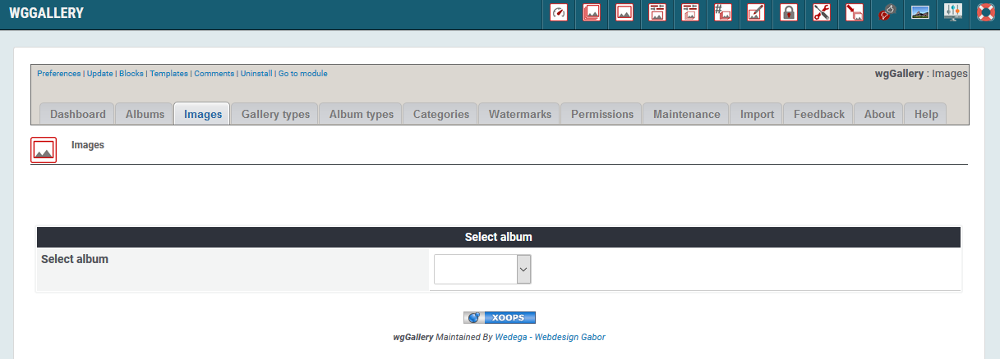
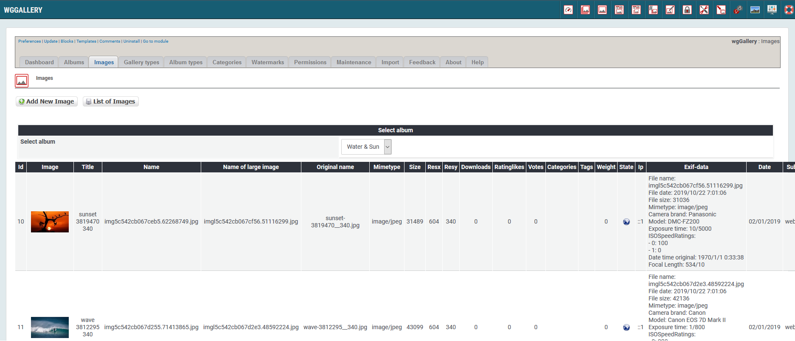

# Bilder

Jedes Bild muss in ein Album hochgeladen werden. Es ist nicht möglich, ein Bild hochzuladen und es später einem oder mehreren Alben zuzuordnen.

Für weitere Details betreffend Bilderupload siehe [Bilder hochladen](image-upload.md).

## 1. Liste der Bilder

Auf dem Registerblatt 'Bilder' sehen Sie eine Liste der derzeit existierenden Bilder. Für die Anzeige müssen Sie zuvor das gewünschte Album auswählen.

Liste der Albumtypen

Nachdem Sie ein Album ausgewählt haben werden die dazugehörigen Bilder angezeigt.

## 2. Hinzufügen von Bildern

Wenn Sie Bilder hinzufügen wollen dann wechselt wgGallery automatisch zur Seite [Bilder hochladen](image-upload.md) on user side.

