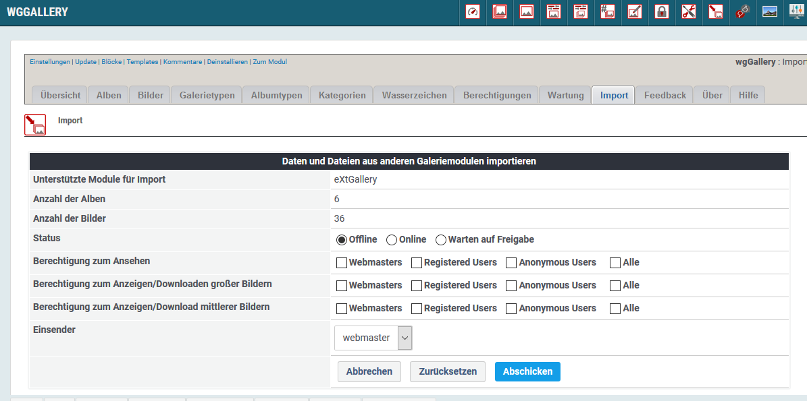

# Import

Auf dem Registerblatt 'Import' stehen derzeit Importroutinen für folgende Module zur Verfügung:

* extGallery
* TDMPicture

Sofern Sie eine weitere Importroutine benötigen kontaktieren Sie den Modulentwickler.

Nach einem Klick auf "Moduldaten lesen" erhalten Sie eine Übersicht über die gefundenen Daten und Sie haben die Möglichkeit zum Setzen von Berechtigungen für die zu importierenden Alben.

