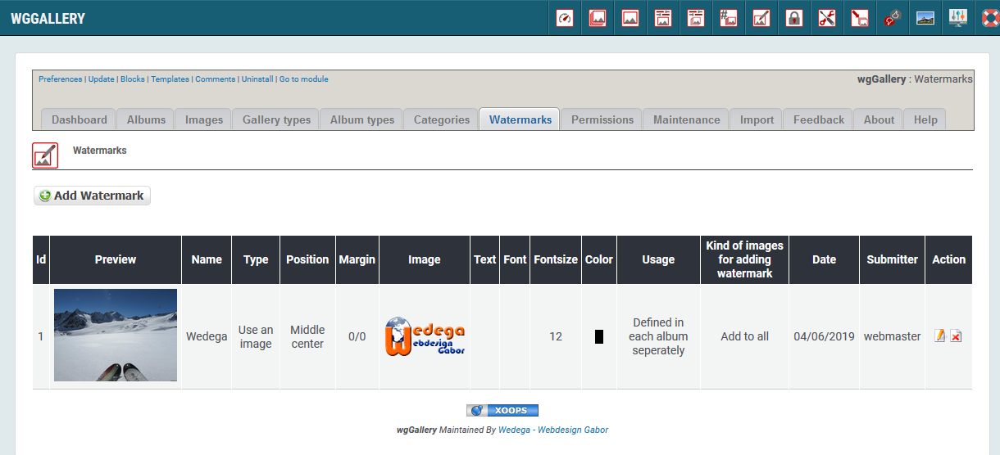
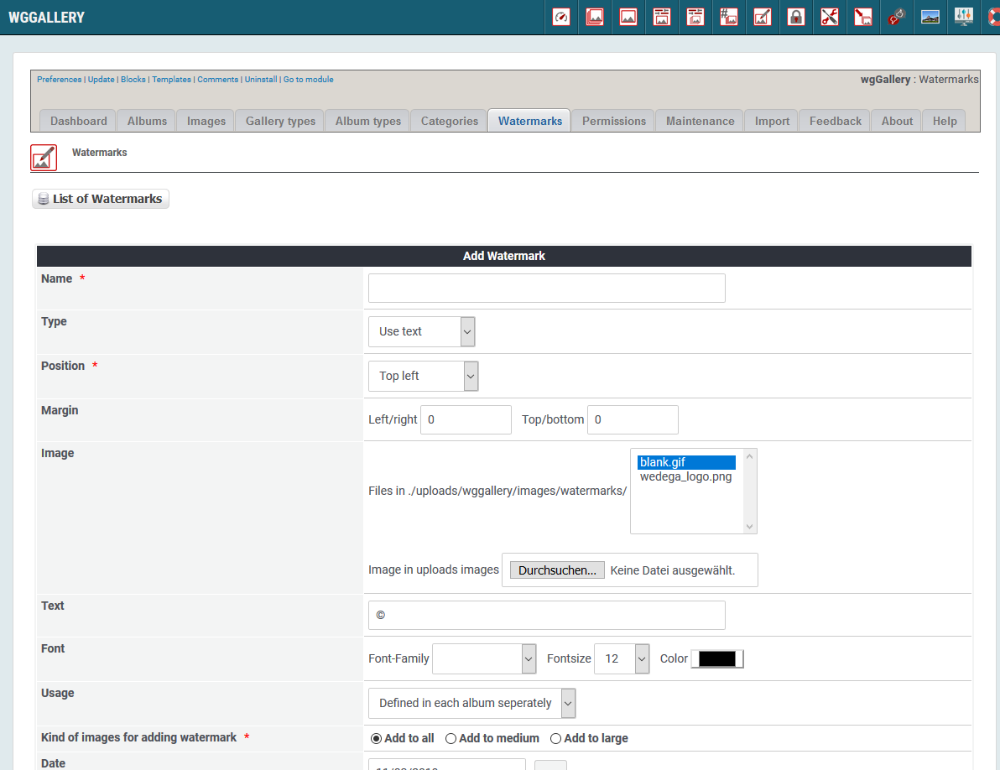

# Wasserzeichen

Sie können veschiedene Wasserzeichen definieren, die dann bei hochgeladenen Bildern hinzugefügt werden. Sie können auch entscheiden, bei welchen Bildarten ein Wasserzeichen hinzugefügt werden soll. Das Wasserzeichen wird während des Uploadvorganges automatisch hinzugefügt. Ein hinzugefügtes Wasserzeichen kann nicht mehr entfernt werden.

Wenn Sie die Originalbilder auch speichern, kann können Sie später die großen/mittleren/kleinen Bilder mit einem neuen oder ohne Wasserzeichen erneut erstellen lassen.

Sie können jedes Album mit einem andern Wasserzeichen verbinden.

## 1. Liste der Wasserzeichen

Auf dem Registerblatt 'Wasserzeichen' sehen Sie eine Liste der bestehenden Wasserzeichen und deren wichtigsten Einstellungen.

## 2. Erstellen/Bearbeiten von Wasserzeichen

### 2.1. Name

Definieren Sie einen Name für Ihr Wasserzeichen.

### 2.2. Typ

Sie können entscheiden, ob ein Bild oder ein Text als Wasserzeichen verwendet werden soll.

### 2.3. Ränder

Sie können die Ränder Ihres Waserzeichens zum Bildrand definieren \(links/rechts, oben/unten\).

### 2.4. Bild

Sie können Ihr eigenes Bild zur Verwendung als Wasserzeichen hochladen. Es wird die Verwendung von png empfohlen, vor allem wenn ein transparentes Logo verwendet werden soll.

### 2.5. Text

Definieren Sie den Text des Wasserzeichens, sofern der "Typ" auf "Text verwenden" gesetzt wurde.

### 2.6. Schriftart

Definieren Sie die Schriftart für Ihr Wasserzeichen, sofern der "Typ" auf "Text verwenden" gesetzt wurde.

### 2.7. Verwendung

Definieren Sie, wo das Wasserzeichen verwendet werden soll:

* Verwenden in jedem Album
* in jedem Album wird das zu verwendende Wasserzeichen separat definiert

### 2.8. Bildart für Hinzufügen Wasserzeichen

Definieren Sie, wo das Wasserzeichen hinzugefügt werden soll:

* bei großen Bildern
* bei mittleren Bildern
* bei beiden

