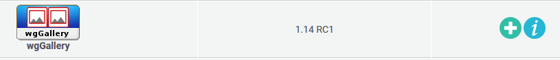

# Installieren und Deinstallieren

Es sind keine speziellen Maßnahmen erforderlich, führen Sie den Standardinstallationsprozess aus. Wenn Sie zustätzliche Informationen benötigen, lesen Sie die Installationshinweise unter [XOOPS Operations Manual](http://goo.gl/adT2i).

## 1. Installation

* Extrahieren Sie den Ordner 'wgsitenotice' in das Module-Verzeichnis
* Loggen sie sich als Administrator und wechseln sie zur Xoops Administrationseite
* Installieren Sie das Modul über Administration -&gt; Module -&gt; Module installieren

  

* Konfigurieren sie das Modul
* Die nächsten Schritte sind nun die Rechteverwaltung des Modules und der Blöcke in System --&gt; Gruppen.

## 2. Deinstallation

Zur Deinstallation klicken sie einfach auf den roten Pfeil

