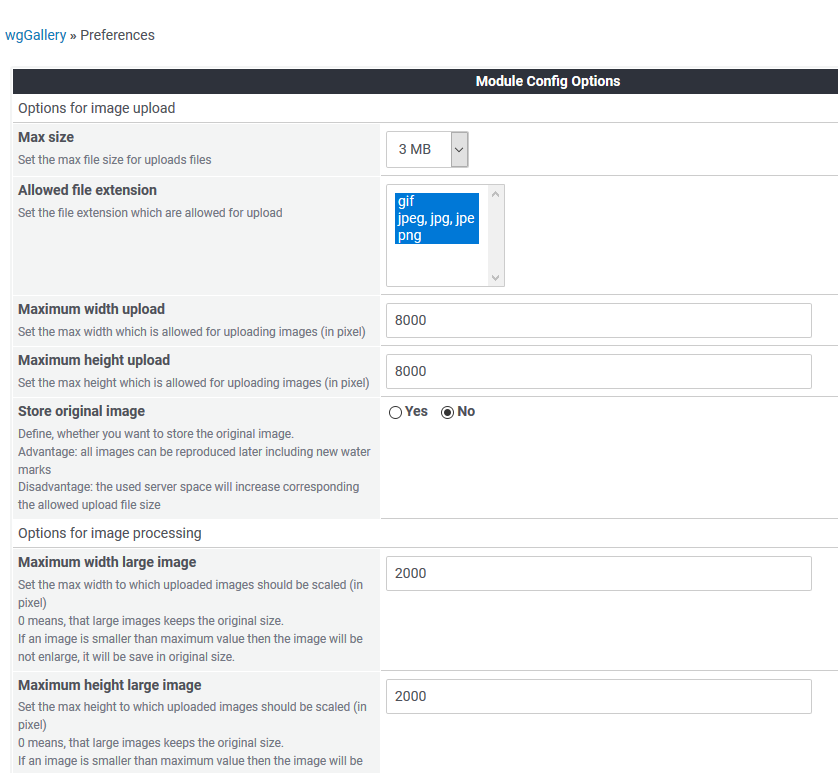

# Einstellungen

In den Moduleinstellungen können Sie zahlreichen Optionen für dieses Modul festlegen:

## Optionen im Detail

* [Optionen für Bilderupload](options-for-image-upload.md)
* [Optionen für die Bildverarbeitung](options-for-image-processing.md)
* [Optionen für die Anzeige](options-for-display.md)
* [Sonstige Optionen](mics-options.md)

