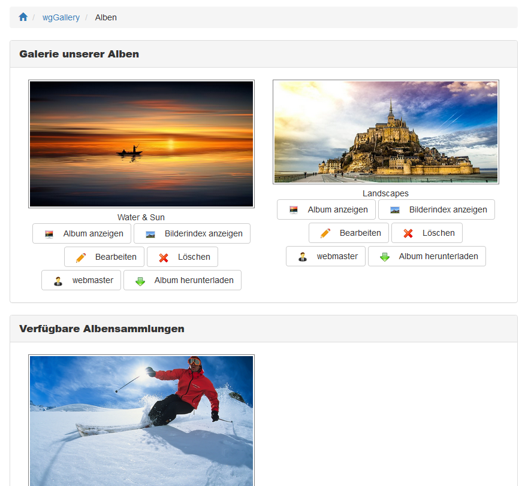

# Benutzerseite

Auf der Indexseite im Benutzerbereich erhalten Sie eine Übersicht über alle Alben und Albensammlungen, die derzeit online sind.

Abhängig von den Berechtigungen des aktuellen Users haben Sie folgende Möglichkeiten

* [Albenmanagement](album-management.md)
* [Album erstellen](create-new-album.md)
* [Bilder hochladen](image-upload.md)
* [Suche Alben oder Bilder](search.md)

