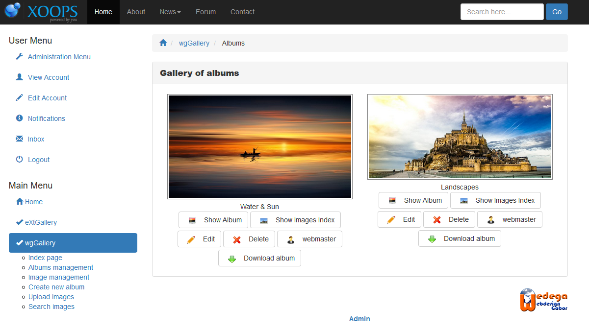

# Benutzerseite

Auf der Indexseite im Benutzerbereich erhalten Sie eine Übersicht über alle Alben und Albensammlungen, die derzeit online sind.

Abhängig von den Berechtigungen des aktuellen Users haben Sie folgende Möglichkeiten

* [Albummanagement](https://github.com/XoopsDocs/wggallery-tutorial/tree/c0578d175b4af5ab03df39ad6c1973b969a45b0c/deutsch/the-user-side/album_management.md)
* [Album erstellen](https://github.com/XoopsDocs/wggallery-tutorial/tree/c0578d175b4af5ab03df39ad6c1973b969a45b0c/deutsch/the-user-side/album_create.md)
* [Bilder hochladen](https://github.com/XoopsDocs/wggallery-tutorial/tree/c0578d175b4af5ab03df39ad6c1973b969a45b0c/deutsch/the-user-side/upload_images.md)
* [Suche Alben oder Bilder]()

