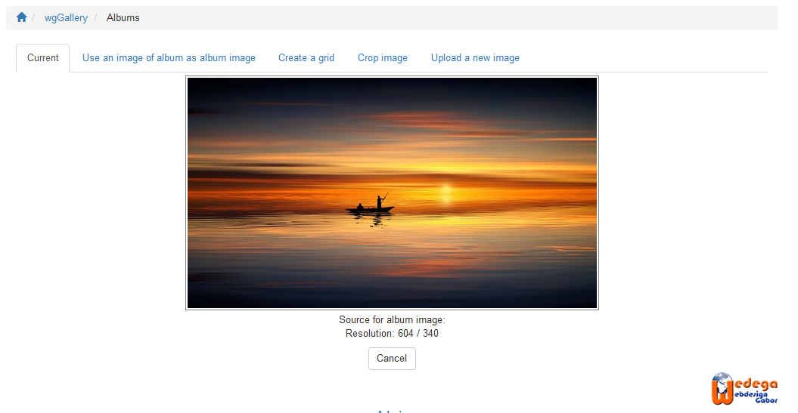
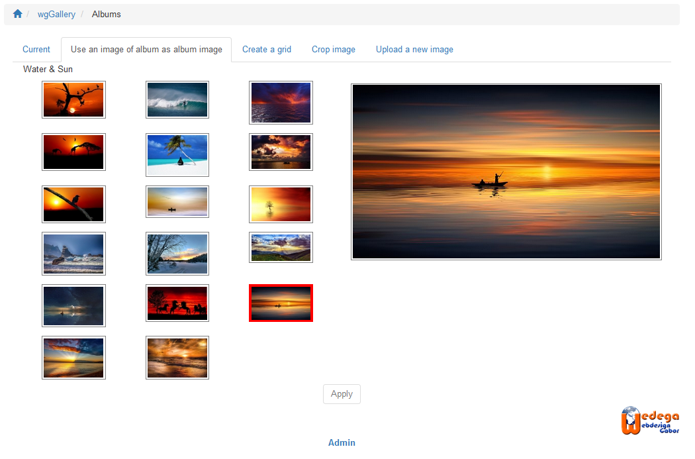
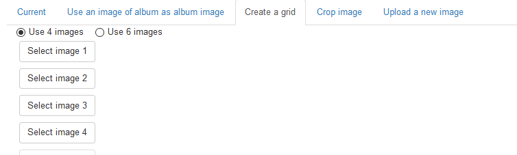
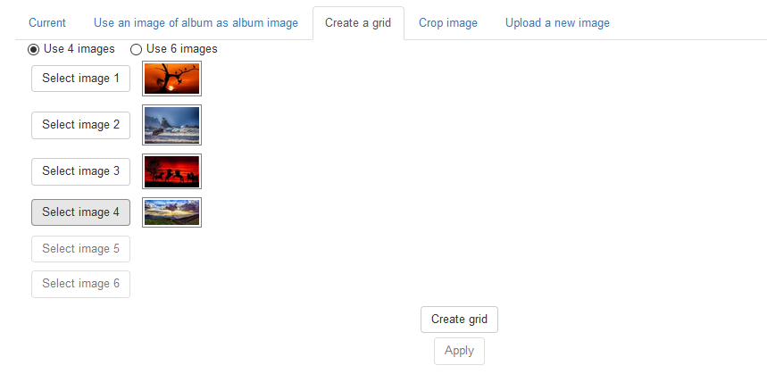
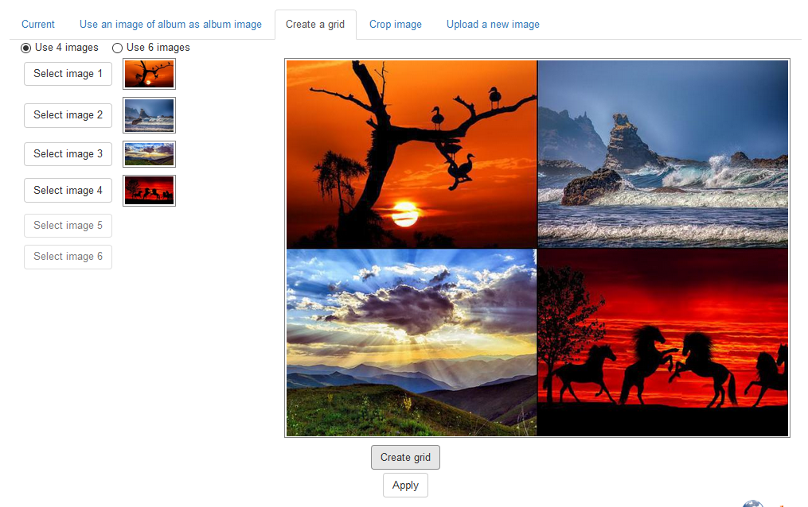
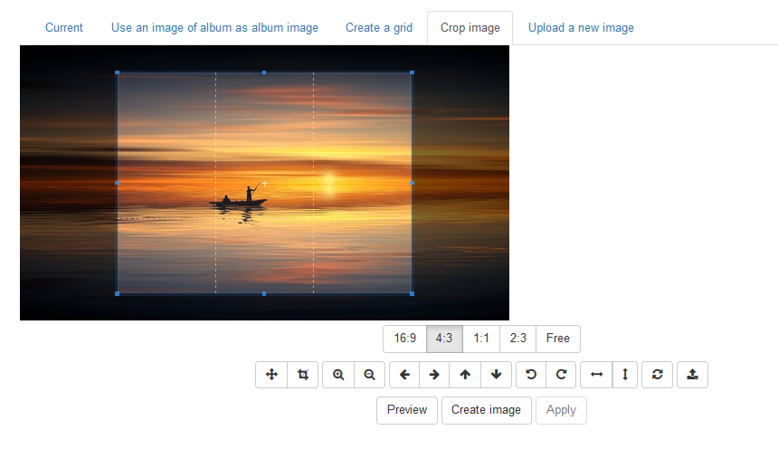
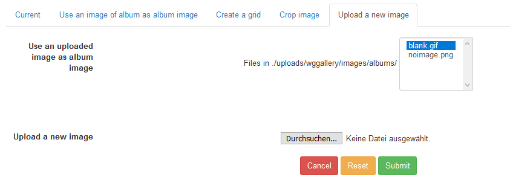

# Albumbild

wgGallery beinhaltet ein umfassendes Tool für die Auswahl/Bearbeitung des Albumbildes. Sie können in verschiedenen Stellen \(z.B. [Albummanagement]()\) die Möglichkeit zur "Bearbeitung Albumbild".

Alle als Albumbild erstellte Bilder werden mit den in den Einstellungen [Optionen für Bildverarbeitung](https://github.com/XoopsDocs/wggallery-tutorial/tree/bf21e41c954096bc925dc762b0fce32cbcf8d0ff/deutsch/preferences/options-for-image-processing/README.md) festgelegten Dimensionen erstellt.

## Tabs des Editors Albumbild

### 1. Aktuell

Registerblatt Aktuell zeigt das derzeit verwendete Albumbild, sofern schon eines definiert wurde.

### 2. Verwende im Album enthaltes Bild

Sie können ein Bild aus dem Album verwenden. Wenn Sie eine Albensammlung bearbeiten, dann haben Sie alle Bilder aller Unterablen zur Verfügung. Auf der linken Seite sehen Sie eine Bildervorschau. Nach dem Anklicken erschein auf der rechten Seite eine große Vorschau.

Für die endgültige Übernahme bitte auf "Anwenden" klicken.

### 3. Bildercollage erstellen

Optional können Sie auch eine Bildercollage mit 4 oder 6 Bildern erstellen, basierend auf den Bildern Ihres Albums. Schritt eins: entscheiden Sie, ob Sie 4 oder 6 Bilder verwenden wollen

Schritt zwei: Bilder auswählen

Die Bilder werden an folgender Stelle verwendet:

* 4 Bilder: 
  * 1 = Oben links
  * 2 = Oben rechts
  * 3 = Unten links
  * 4 = Unten rechts
* 6 Bilder: 
  * 1 = Oben links
  * 2 = Oben mitte
  * 3 = Oben rechts
  * 4 = Unten links
  * 5 = Unten mitte
  * 6 = Unten rechts

Nach dem Klick auf "Bildercollage erstellen" wird das Bild erstellt und auf der rechten Seite angezeigt.

Für die endgültige Übernahme bitte auf "Anwenden" klicken.

### 4. Bild zuschneiden

Wenn ein Bild gewählt wurde, dann kann dieses Bild zusätzlich bearbeitet werden.

Sie können zuschneiden, zoomen, drehen und so weiter. Wenn der ausgewählte Bereich den Vorstellungen entspricht dann bitte auf "Bild erstellen" klicken.

Für die endgültige Übernahme bitte auf "Anwenden" klicken.

### 5. Neues Bild hochladen

Als letzte Mölichkeit wird natürlich auch das Hochladen neuer Bilder in das Verzeichnis /uploads/wggallery/images/albums/ durchzuführen.

