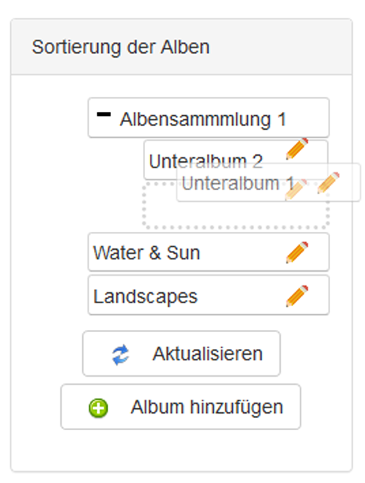

# Albenmanagement

## 1. Unterschied zwischen Alben und Albensammlungen

### Album

Ein Album enthält ein oder mehrere Bilder. Sie können die Berechtigungen für jedes Album unterschiedlich vergeben.

### Albensammlungen

Albensammlungen sind wie Container oder Ordner für eine oder mehrere Alben. Die für eine Albensammlungen gesetzten Berechtigungen gelten NICHT für die darin enthaltenen Alben. Eine Albensammlungen sollte keine Bilder enthalten, da sie nirgends angezeigt werden.  
Sie erkennen eine Albensammlungen an der Anzahl der enthaltenen Alben:

## 2. Übersicht

Auf der Seite Albenmanagement erhalten Sie eine Übersicht über alle Alben und Albensammlungen

Auf der rechten Seite erscheint der Bereich für die Sortierung der Alben.

## 3. Sortierung der Alben

Sie können die ALben einfach mit Drag&Drop verschieben und sortieren.  
Bei einem Klick auf "+" wird die jeweilige Albensammlung erweitert, bei "-" reduziert.  
Sie können einen beliebig großen Verzeichnisbaum erstellen.

## 3. Zusätzliche Schaltflächen

Abhängig von Ihren [Berechtigungen](../administration-menu/permissions.md) sehen Sie zusätzliche Schaltflächen wie z.B.

* [Album anzeigen](displaying-albums.md)
* [Bilderindex anzeigen](image-index.md)
* [Bildermanagement](image-management.md)
* [Bilder hochladen](uploading-images.md)
* [Neues Album erstellen](create-new-album.md)
* [Albumbild bearbeiten](album-image.md)
* "Delete"
* "Download album"

