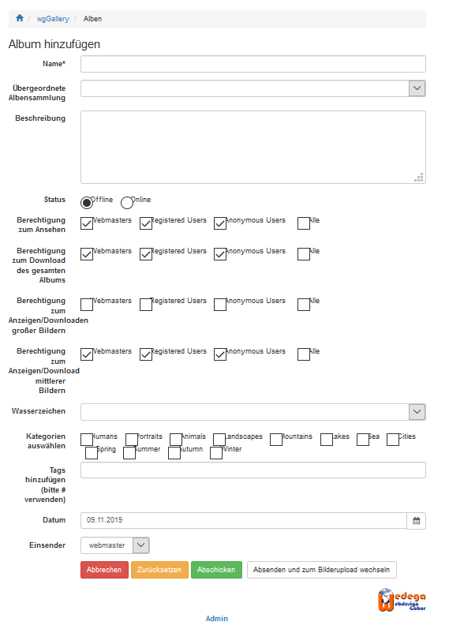

# Neues Album erstellen

## 1. Schritte zum Erstellen von Alben/Albensammlungen

* Formular öffnen
* Daten eingeben
* Absenden und gegebenenfalls zum [Bilder hochladen](uploading-images.md) gehen

## 2. Felder

### Name

Name des Albums eingeben

### Übergeordnete Albensammlung

Wenn Sie die Anmeldung einer bestimmten Albensammlung zuweisen wollen dann können Sie dies hier definieren, ansonsten frei lassen.

### Beschreibung

Sie können weitere Details für Ihr Album hier erfassen.

### Satus

Definieren Sie den Status. Solange der Status nicht "Online" ist, ist das Album für andere User nicht sichtbar. Wenn Sie nicht die Brechtigung zum Einsenden von Alben ohne Freigabe haben, dann wird der Status des Albums automatisch auf "Warten auf Freigabe" gesetzt.

### Berechtigung zum Ansehen

Definieren Sie die Gruppen mit der Berechtigung zum Ansehen der Alben.

### Berechtigung zum Download des gesamten Albums

Definieren Sie die Gruppen mit der Berechtigung zum Download der Alben als Ganzes. Diese Einstellung ist für Albensammlungen nicht gültig.

### Berechtigung zum Anzeigen/Downloaden großer Bildern

Definieren Sie die Gruppen mit der Berechtigung zum Anzeigen und Downloaden der großen Bilder. Diese Einstellung ist für Albensammlungen nicht gültig.

### Berechtigung zum Anzeigen/Downloaden mittlerer Bildern

Definieren Sie die Gruppen mit der Berechtigung zum Anzeigen und Downloaden der mittleren Bilder. Diese Einstellung ist für Albensammlungen nicht gültig.

### Wasserzeichen

Sofern ein Wasserzeichen je Album aktiviert werden kann so ist hier das entsprechende Wasserzeichen zu wählen.
Für weitere Informationen siehe auch [Wasserzeichen](../administration-menu/watermarks.md)

### Kategorien auswählen

Sofern Sie Kategorien verwenden so können Sie hier eine oder mehrere Kategorien auswählen.
Für weitere Informationen siehe auch [Kategorien](../administration-menu/categories.md)

### Tags eingeben

Zusaätzlich zu den Kategorien können weitere Informationen als Tags erfasst werden.
