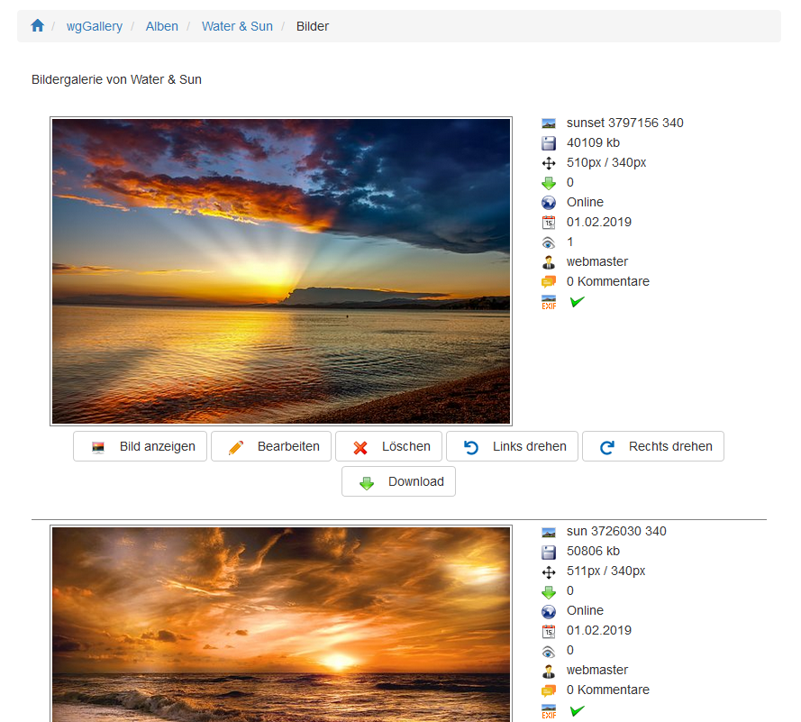

# Bilderindex

Im Bilderindex sehen Sie alle Blder von einem bestimmten Album.

Auf der Bilderindexseite sehen Sie

* eine Bildvorschau
* die zum Bild vorhandenen Informationen

Für jedes Bild können Sie \(sofern Sie die entsprechenden Berechtigungen besitzenn\)

* Bild anzeigen: abhängig von Ihren Einstellungen bei [Optionen für Anzeige](../preferences/options-for-display.md) wird das Bild in einem neuen Register, als modales Fenster, usw. angezeigt.
* Bildinformationen bearbeiten
* Bilder löschene
* Bilder links oder rechts drehen
* Bild herunterladen: abhängig von Ihren Einstellungen bei [Berechtigungen](../administration-menu/permissions.md) wird entweder das große oder das mittlere Bild zum Download bereitgestellt

