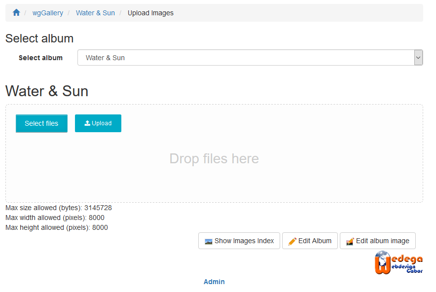
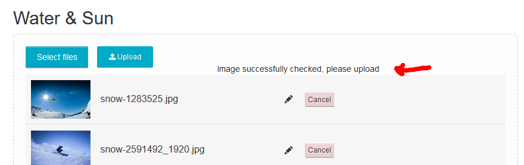
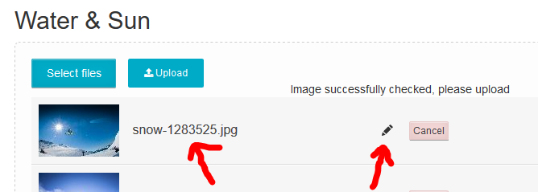
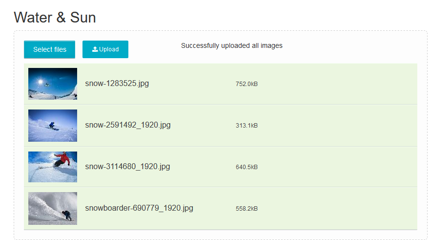

# Bilder hochladen

wgGallery unterstützt den Multifile-Upload. Das Uploadtool führt neben dem normalen Uploadvorgang auch noch zusätzliche Aufgaben aus.

### Schritte für das Hochladen

* Wählen Sie das gewünschte Album aus. Danach erscheint der Uploadbereich

* Wählen Sie Ihre Bilddateien über den Explorer aus \(Klick auf "Dateien auswählen"\) oder ziehen Sie diese mit Drag&Drop in die Drop-Zonee. 
 Achtung: seitens wgGallery besteht kein Limit, wieviele Dateien Sie auf einmal hochladen können, aber wahrscheinlich sind Sie durch Ihr Webseitensystem \(PHP-Einstellungen\) limitiert. Sie können Ihre Einstellungen unter Wartung [Systemcheck](../administration-menu/maintenance/system-check.md) überprüfen.

* Nach dem Hinzufügen der Dateien in die Uploadliste überprüft wgGallery, ob die Dateien die Voraussetzungen erfüllen:

  * Ist die maximale Dateigröße überschritten?
  * Werden die maximal erlaubten Bilddimensionen \(Breite oder Höhe\) überschritten?

   Sie können die Einstellungen betreffend der erlaubten Gößen unter [Optionen für Bildupload](../preferences/options-for-image-upload.md) ändern.

* Wenn alle Dateien die Vorraussetzungen erfüllen wird dies durch wgGallery bestätigt 

* wgGallery verwendet standardmäßig den Dateinamen als Bildtitel. Wenn Sie Bildtitel ändern wollen so können Sie auf den vorgeschlagenen Titel oder den Bearbeiterstift klicken   

* Upload starten

* Verarbeitungen während des Uploadvorganges
  * Das Originalbild wird gespeichert, sofern dies in den Einstellungen [Optionen für Bilderupload](../preferences/options-for-image-upload.md) aktiviert wurde
  * Die Bilder \(groß, mittel, Vorschaubild\) werden entsprechend den Einstellungen [Optionen für Bilderupload](../preferences/options-for-image-upload.md) erstellt
  * Wasserzeichen werden hinzugefügt, sofern für das aktuelle Album Wasserzeichen gewählt wurden \(siehe [Alben](../administration-menu/albums.md) und [Wasserzeichen](../administration-menu/watermarks.md)\)
  * saving different types \(large, medium, thumb\) of images in upload directory
  * reading information of image
    * size
    * dimension
    * mime type
    * EXIF \(only if option in preferences [Options for image processing](../preferences/options-for-image-processing.md)
* After successful upload each line gets a green backgound and the upload tools confirm success   

## Next steps

After uploading the images you can goto

* [Image index](image-upload.md) in order to check all images
* [Image management](image-management.md) in order to check/change sorting of images
* [Album image](album-image.md) in order to select an image as album image

