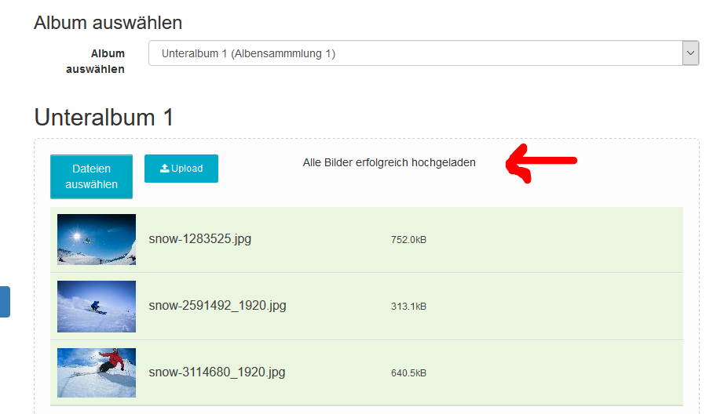

# Bilder hochladen

wgGallery unterstützt den Multifile-Upload. Das Uploadtool führt neben dem normalen Uploadvorgang auch noch zusätzliche Aufgaben aus.

### Schritte für das Hochladen

* Wählen Sie das gewünschte Album aus. Danach erscheint der Uploadbereich

* Wählen Sie Ihre Bilddateien über den Explorer aus \(Klick auf "Dateien auswählen"\) oder ziehen Sie diese mit Drag&Drop in die Drop-Zone.

 Achtung: seitens wgGallery besteht kein Limit, wieviele Dateien Sie auf einmal hochladen können, aber wahrscheinlich sind Sie durch Ihr Webseitensystem \(PHP-Einstellungen\) limitiert. Sie können Ihre Einstellungen unter Wartung [Systemcheck](../administration-menu/maintenance/system-check.md) überprüfen.

* Nach dem Hinzufügen der Dateien in die Uploadliste überprüft wgGallery, ob die Dateien die Voraussetzungen erfüllen:

  * Ist die maximale Dateigröße überschritten?
  * Werden die maximal erlaubten Bilddimensionen \(Breite oder Höhe\) überschritten?

   Sie können die Einstellungen betreffend der erlaubten Größen unter [Optionen für Bildupload](../preferences/options-for-image-upload.md) ändern.

* Wenn alle Dateien die Vorraussetzungen erfüllen wird dies durch wgGallery bestätigt 
* wgGallery verwendet standardmäßig den Dateinamen als Bildtitel. Wenn Sie Bildtitel ändern wollen so können Sie auf den vorgeschlagenen Titel oder den Bearbeiterstift klicken 
* Upload starten
* Verarbeitungen während des Uploadvorganges
  * Das Originalbild wird gespeichert, sofern dies in den Einstellungen [Optionen für Bilderupload](../preferences/options-for-image-upload.md) aktiviert wurde
  * Die Bilder werden entsprechend den Einstellungen [Optionen für Bilderupload](../preferences/options-for-image-upload.md) als groß, mittel, Vorschaubild erstellen
  * Wasserzeichen werden hinzugefügt, sofern für das aktuelle Album Wasserzeichen gewählt wurden \(siehe [Alben](../administration-menu/albums.md) und [Wasserzeichen](../administration-menu/watermarks.md)\)
  * Speichern der verschiedenen Bildarten \(large, medium, thumb\) im Upload-Verzeichnis
  * Einlesen der Bildinformatione
    * Größe
    * Dimensionen
    * Mime-Type
    * EXIF-Daten \(nur wenn dies in Einstellungen [Optionen für Bildverarbeitung](../preferences/options-for-image-processing.md) aktiviert wurde\)
* Nach dem erfolgreichen Hochladen wechselt die Hintergrundfarbe bei jeder Zeile auf grün und der vollständige Upload wird bestätigt   

## Nächste Schritte

Nach dem Hochladen können Sie weitergehen zu:

* [Bildindex](image-upload.md) zur Überprüfung der Bilder
* [Bildermanagement](image-management.md) zur Überprüfung/Änderung der Sortierung der Bilder
* [Albumbild erstellen](album-image.md) zur Auswahl/Erstellung eines Albumbildes

