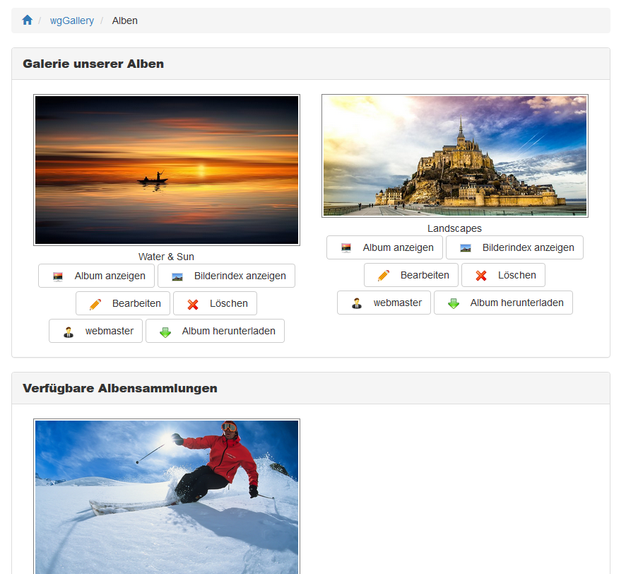

# Indexseite

Auf der Hauptseite von wgGallery erhalten Sie eine Übersicht über alle Alben und Albensammlungen, welche derzeit online sind.

## Zusätzliche Schaltflächen

Abhängig von Ihren [Berechtigungen](../administration-menu/permissions.md) sehen Sie zusätzliche Schaltflächen wie z.B.

* [Album anzeigen](displaying-albums.md)
* [Bilderindex anzeigen](image-index.md)
* [Bildermanagement](image-management.md)
* [Bilder hochladen](https://github.com/ggoffy/wggallery-tutorial/tree/6db781ee87636b25a81862e0b0e16b456c78ac72/deutsch/the-user-side/ploading-images.md)
* [Neues Album erstellen](create-new-album.md)
* [Albumbild bearbeiten](album-image.md)
* "Delete"
* "Download album"

