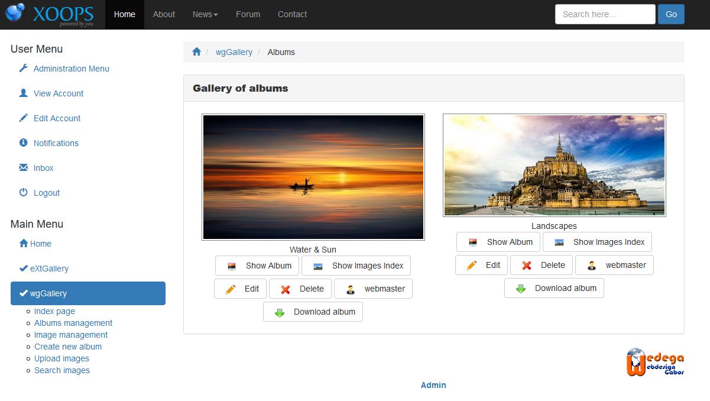

# Index page

On the main page of wgGallery you get an overview about all albums and collections, which are currently online.

## Additional buttons

Depending on your permissions \(see [Permissions](../administration-menu/permissions.md) [Permissions](https://app.gitbook.com/@xoops/s/wggallery-tutorial/~/edit/drafts/-LspRs8jjiGYCcVslyVk/english/administration-menu/permissions)\) you will see addtional buttons like

* "Show album" \(see [Displaying albums](displaying-albums.md)\)
* "Show images index \(see[ Image index](image-index.md)\)
* "Edit" \(see [Create new album](create-new-album.md)\)
* Submitter \(on image "webmaster"\), which will show a list of albums of this submitter
* "Delete"
* "Download album"

